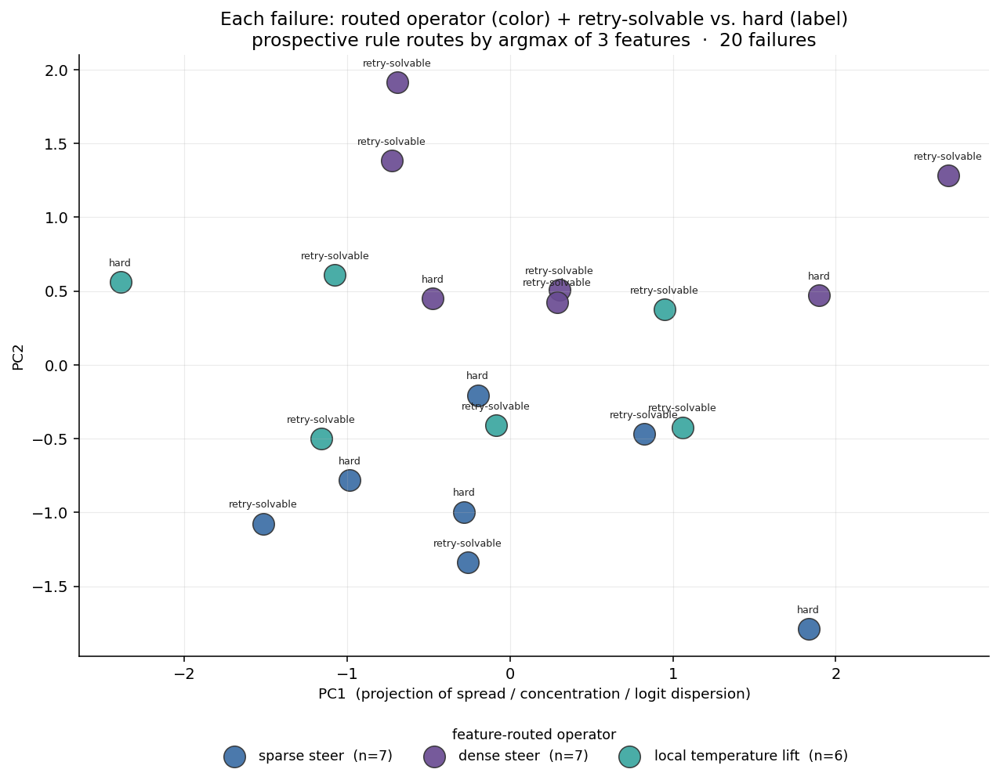

# vllm-logits

**A toolkit for two-model logit interventions on top of [vLLM](https://github.com/vllm-project/vllm).**

It loads two models — a *specialist* (e.g. your fine-tune) and an *ancestor* (e.g. its
base/reference) — into a single vLLM model so you can **mix or steer their logits at decode time
with no extra forward passes**, and it ships a small pipeline that uses this to:

1. **extract per-token features** from failed generations (how far the specialist diverged from the
   ancestor at each step), and
2. **repair** those failures by nudging decoding back toward the ancestor's suppressed alternatives,
   then report which failures were fixable and how.

Everything is driven by plain inputs — two model paths, your prompts, your rollouts, and a one-line
correctness function — so it runs on **any model and any task**, on any cluster or a single GPU.

```python
from vllm_logits import LogitPipeline, numeric_answer

pipe = LogitPipeline(
    specialist="Qwen/Qwen3-0.6B",        # any HF id or local path
    ancestor="Qwen/Qwen3-0.6B-Base",     # base / stronger / cross-family reference
    arch="auto",                          # detects the right dual backbone from the model config
    T=0.6, alpha=0.7,                     # decode temperature; mixing strength
    continuation_mode="temperature",      # how to decode after an intervention (see below)
)

# Inputs are plain dicts (or JSONL) — no framework objects, no registries:
#   problem = {"problem_id": str, "prompt": str, "answer": ...}
#   rollout = {"problem_id": str, "rollout_idx": int, "generated_text": str, "is_correct"?: bool}

results = pipe.run(
    problems, rollouts,
    correctness_fn=numeric_answer("answer"),   # the only task-specific input
    operators=["geo", "rand", "dense", "local_temp"],
    k_values=[1, 5, 10],
)
# results[i] = {"pid": ..., "retry": {...}, "geo_pred": {...}, "rand": {...}, "dense": {...}, ...}
# pipe.run() = extract features over the failed rollouts, then sweep the repair operators.
# You can also call the two stages separately: pipe.cache_logits(...) then pipe.repair(...).
```

## Install

```bash
pip install -e .          # core
pip install -e ".[dev]"   # + pytest, huggingface_hub (for the tests)
```

Requires **Python ≥ 3.10** and **`vllm` 0.15.x** (pinned — see [Compatibility](#compatibility)),
plus `torch`, `transformers`, and `pyarrow`/`polars`.

## How it works

```
  specialist (your fine-tune)  ─┐
                                ├──▶  ONE vLLM model: both logit streams,
  ancestor   (base / reference)─┘     mixed/steered before the LM head
                                      (no extra forward pass)
                                              │
   problems + failed rollouts + correctness_fn
                                              │
                                              ▼
  [1] cache_logits  ── at each token of a failed trace, measure how far the
          fine-tune drifted from its base model, and find the junction (if any):
          the window of tokens where the failure was decided
                                              │
                                              ▼
  [2] repair  ── at the junction, apply an operator and re-decode
          retry · sparse steer · dense steer · local temperature
                                              │
                                              ▼
   ▶  which failures are fixable, and by which operator

   ...and the 3 trace features route each failure with no repair outcomes:
          spread            ──▶  dense steer
          concentration     ──▶  sparse steer
          logit dispersion  ──▶  local temperature lift
```

- **Two backbones in one model.** `backbones.py` defines `DualQwen2/Llama/Phi3ForCausalLM`: a single
  vLLM model that loads both checkpoints and exposes both logit streams before the LM head, so a
  logits processor can combine them with zero extra passes. `arch="auto"` picks the right one from
  the model's config; adding a new architecture is one subclass + one registration line.
- **Logits processors** (`processors/`): `inject` (target chosen positions), `proxy_tuning`
  (specialist + α·(specialist − ancestor) style arithmetic — a reference implementation of
  [proxy-tuning](https://arxiv.org/abs/2401.08565), which is similar in spirit to our logit
  steering), `cross_arch` (mismatched tokenizers), and `logit_repair` (the steering processor used
  by the repair stage).
- **Feature extraction** (`features.py`, the `cache_logits` stage): for each failed rollout it runs
  two batched prefills and stores per-token features — the specialist↔ancestor divergence on the
  taken token (`Delta_path`), coverage-set divergence (`G_cov`), logit variance / entropy, local KL,
  and a combined `J_approx` (every feature is defined in
  [docs/logit-features.md](docs/logit-features.md)). The **junction** is the window of tokens
  (around the `J_approx` peak) where the failure was decided; it is where the targeted operators act.
- **Repair** (`repair.py`, the `repair_logits` stage): it applies each operator and re-decodes —
  sparse logit steering and local temperature lift fire **at the junction**, random-position steer
  at a control position, and dense steer over the whole trace — reporting whether the result is
  correct at each `k`.

### `continuation_mode`

After an intervention fires, the rest of the sequence is decoded one of two ways (applied uniformly
to every operator):

| mode | post-intervention decode | use it for |
|---|---|---|
| `temperature` *(default)* | sample the specialist at `T` (same as the retry baseline) | **production** — the realistic recoverability number |
| `greedy` | argmax of the specialist | **analysis** — isolates the intervention (a rescue is attributable to the steer, not to lucky downstream sampling) |

## Worked example 1 — three outcomes of a failure, explained by features

`examples/showcase_three_regimes.py` runs on **Qwen3-0.6B** (specialist) vs. **Qwen3-0.6B-Base**
(ancestor) over a small set of simple arithmetic problems (e.g. `Compute 17 * 23. Put the final
answer in \boxed{}.`). It takes the problems the specialist fails on every sampled rollout and
classifies what (if anything) rescues each, alongside the junction-feature profile. **The output
below is real** (regenerated by the script):

```
PROBLEM    retry  rand   geoP   geoW   dense  Ltemp    V_traj  V_junc   kl_jc  Gcov_jc  Dpath_jc
p5         -      OK     OK     -      -      OK        0.151   0.143    1.06    0.195     1.231   [STEERABLE]
p11        -      -      -      -      -      OK        0.102   0.181   11.50    0.032     1.586   [STEERABLE]
p2         OK     OK     -      OK     -      OK        0.161   0.288   12.37    0.087     1.963   [SAMPLING]
p3         OK     OK     OK     -      -      OK        0.154   0.268    8.75    0.121     2.105   [SAMPLING]
p9         -      -      -      -      -      -         0.108   0.222    4.16    0.018     1.948   [HARD]   739*856
p14        -      -      -      -      -      -         0.119   0.196    5.60    0.019     1.869   [HARD]   12345*6789
regime counts: {'SAMPLING': 7, 'STEERABLE': 3, 'HARD': 4}
```

Columns are the operators (`OK` = rescued at some `k`): `retry` (resample), `rand` (ancestor
injection at a random position), `geoP`/`geoW` (sparse steer at the detected junction vs. a control
position), `dense` (steer at every position), `Ltemp` (local temperature lift). The right-hand columns
are the junction-feature profile (`V_traj`, `V_junc`, KL, `G_cov`, `Delta_path` at the junction).

- **SAMPLING** — plain resampling fixes it; the first failure was just an unlucky draw.
- **STEERABLE** — resampling fails, but a logit intervention fixes it: the correct alternative was
  present but suppressed, and steering toward the ancestor surfaces it.
- **HARD** — nothing fixes it. Notice `Gcov_jc` collapses to ~0.02 on the hard multiplications: the
  ancestor is *also* wrong there, so there is no correct alternative to steer toward. That collapse
  is the readable signature of a genuinely unrecoverable failure.

## Worked example 2 — routing failures to a repair operator from features alone

`examples/showcase_clustering.py` reduces each failed problem to **three trajectory features**, and
each feature maps to the one operator it makes actionable:

| feature | definition | routes to |
|---|---|---|
| **spread** | `J_frac+` — fraction of trace tokens with `J_approx > 0` (how broad the divergence is) | `dense steer` |
| **concentration** | `log10(J_max / J_mean)` — one sharp spike vs. diffuse | `sparse steer` |
| **logit dispersion** (temperature sensitivity) | `log10(V_t*)` — variance of the specialist's logits at the junction; how strongly the token responds to a temperature change | `local temperature lift` |

The **prospective routing rule** z-scores the three features per problem and routes each failure to
the operator whose feature is largest (`argmax`, no gate) — read from the failed trace alone, no
repair outcomes needed.

A **single panel** carries both signals on every point, over a 2-D projection of the three features:
the **color** is the operator the feature rule picks, and the **label** is the failure's empirical
recoverability at a best-of-3 budget — `retry-solvable` (plain resampling fixes it; no routing needed)
or `hard` (it doesn't, so a logit intervention or a local-temperature lift is what can still help —
the paper's routing target). In Example 1's terms, `retry-solvable` is the SAMPLING regime and `hard`
is STEERABLE and HARD combined.



```
routing features (z-scored):  spread -> dense steer | concentration -> sparse steer | logit dispersion -> local temperature lift
--------------------------------------------------------------------------------------------
routed operator            n            spread     concentration  logit dispersion
sparse steer               7             -0.43              0.88             -0.20
dense steer                7              0.60             -0.73             -0.65
local temperature lift     6             -0.20             -0.17              0.99
--------------------------------------------------------------------------------------------
recoverability (empirical): {'retry-solvable': 13, 'hard': 7}
over 20 failing problems
```

Each routed bucket has its own signature feature highest — `dense steer` the highest `spread`,
`sparse steer` the highest `concentration`, `local temperature lift` the highest `logit dispersion` —
so the rule reads the same way on your own data. (This is a 0.6B arithmetic toy, so the split is
illustrative; on harder real cells the `hard` set is the routing target population, exactly as in the
paper.) Results are cached to `docs/clustering_data.json` so re-plotting needs no GPU — delete it or
set `VLLM_LOGITS_FORCE=1` to recompute.

## API reference

| Module | Contents |
|---|---|
| `pipeline.py` | `LogitPipeline` — the one entry point (`.run`, `.cache_logits`, `.repair`). |
| `backbones.py` | `DualQwen2/Llama/Phi3ForCausalLM` (+ a repair variant): two checkpoints in one vLLM model, mixable logits. |
| `processors/` | `inject`, `proxy_tuning`, `cross_arch`, `logit_repair` (the steering processor with `continuation_mode`). |
| `register.py` | `register_dual_{qwen,llama,phi3}` — vLLM ModelRegistry shims (auto-loaded, see below). |
| `features.py` | `cache_logits`: per-token features (`Delta_path`, `G_cov`, `logit_var`, `entropy`, `kl_div`, `J_approx`; defined in [docs/logit-features.md](docs/logit-features.md)) via two batched prefills. |
| `scoring.py` | `compute_scores_at_t`, `estimate_background`, and reference (HF) engines. |
| `junctions.py` | junction detectors (Page-Hinkley, divergence, coverage, random) + offline firing on cached features. |
| `repair.py` | `LogitRepairEngine`: batched operator × `k` sweep. |
| `storage.py` | `LogitStore` — feature cache as `.pt` or parquet shards, format auto-detected on read. |
| `io.py` | the input contract: `Problem`/`Rollout` dicts, JSONL helpers, and `exact_match` / `numeric_answer` / `regex` correctness defaults. |
| `alpha.py` | `entropy_gap`, `chi2_divergence`, `adaptive_alpha`. |
| `_compat.py` | every vLLM-internal import, isolated in one place (the version-bump firewall). |

Registration is automatic: the package declares a `vllm.general_plugins` entry point, so the dual
backbones are registered in every vLLM process (including spawned workers) without you calling
`register_*()`.

## Tests

```bash
PYTHONPATH=src python -m pytest tests/test_cache_logits_parquet.py        # CPU: cache round-trip
# GPU: confirm the dual backbones load and reproduce exact greedy outputs:
export VLLM_WORKER_MULTIPROC_METHOD=spawn NCCL_IB_DISABLE=1 NCCL_P2P_DISABLE=1
PYTHONPATH=src python -m pytest tests/test_dual_load_qwen.py tests/test_dual_load_phi4.py -s
```

## Supported model families

`arch="auto"` reads the model's `config.model_type` and selects the matching dual backbone. The
specialist and ancestor must share an architecture (they are loaded into one vLLM model). Supported
families:

| `model_type` | dual backbone | example models |
|---|---|---|
| `qwen2`, `qwen3` | `DualQwen2ForCausalLM` | Qwen3-0.6B/1.7B/4B/8B, Qwen2.5 / Qwen2.5-Math (incl. R1-Distill-Qwen) |
| `phi3` | `DualPhi3ForCausalLM` | Phi-3, Phi-4-mini (instruct / reasoning) |
| `llama` | `DualLlamaForCausalLM` | Llama-family checkpoints |
| `olmo2`, `olmo3` | `DualQwen2ForCausalLM` | OLMo-2 / OLMo-3 (Qwen2-shaped) |

Qwen and Phi are verified end-to-end on GPU; Llama and OLMo run through the same backbone code path.
Anything not listed takes a one-time addition — see below.

## Adding a new architecture

Subclass `DualQwen2ForCausalLM` in `backbones.py`, add a `register_*` line in `register.py`, and add
the `model_type → register` entry in `pipeline._ARCH_REGISTER`. The dot-anchored
`stacked_params_mapping` in `backbones.py` is load-bearing for correct weight loading — keep it.

## Compatibility

Pinned to **`vllm>=0.15,<0.16`** (tested on vLLM 0.15.1 / torch 2.9.1, NVIDIA L40S / A100 / H100).
The dual backbones subclass vLLM internals, all confined to `_compat.py`; run the dual-load tests
after a vLLM upgrade — if they stay green, the version is supported.

## Citation

If you use `vllm-logits`, please cite the accompanying paper:

```bibtex
@misc{islah2026failedreasoningtraces,
  title         = {Failed Reasoning Traces Tell You What Is Fixable (But Not by Reading Them)},
  author        = {Islah, Nizar and others},
  year          = {2026},
  eprint        = {2606.05145},
  archivePrefix = {arXiv},
  url           = {https://arxiv.org/abs/2606.05145},
}
```

## License

Apache-2.0.
